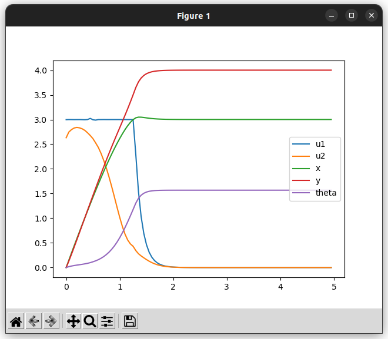
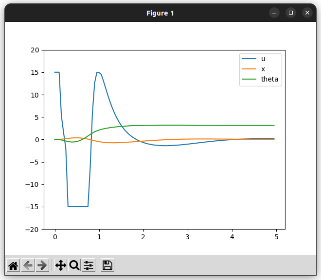

# AL-iLQR

!!! example "ソースコード"
    [example/controller/alilqr_diffbot_example.cpp](https://github.com/Kotakku/cpp_robotics/blob/develop/example/controller/alilqr_diffbot_example.cpp)  
    [example/controller/alilqr_cartpole_example.cpp](https://github.com/Kotakku/cpp_robotics/blob/develop/example/controller/alilqr_cartpole_example.cpp)

AL-iLQRを用いて非線形モデルの最適制御を行います。  
制約として入力量のbox制約を指定しています。

## 差動二輪

## Cartpole
