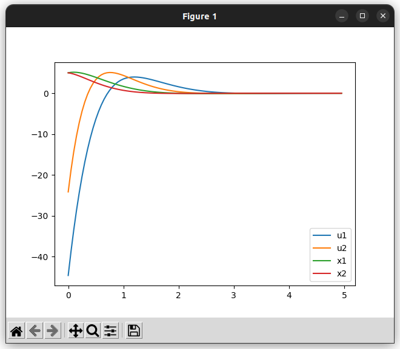
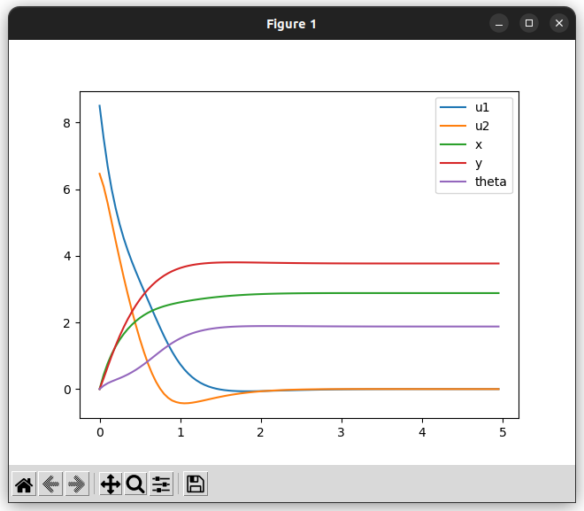

# iLQR

iLQRを用いて線形/非線形モデルの最適制御を行います。  

!!! warning
    cpp_roboticsに実装しているiLQRでは制約が扱えません

## double-integrator
{{ include_example("example/controller/ilqr_linear_example.cpp") }}

## 差動二輪
{{ include_example("example/controller/ilqr_diffbot_example.cpp") }}
