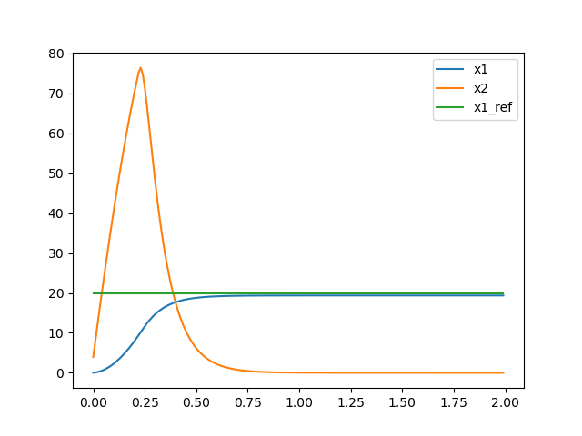

# LQR

以下のシステムをLQRで制御します

$$
\frac{d}{dt}
\left [\begin{array}{c}
x_1 \\
x_2
\end{array}
\right ]
=
\left [\begin{array}{c}
0 & 1 \\
-10 & -1
\end{array}
\right ]
\left [\begin{array}{c}
x_1 \\
x_2
\end{array}
\right ]
+
\left [\begin{array}{c}
0 \\
1
\end{array}
\right ]
u
$$

重み行列は以下のようにします

$$
Q=
\left [\begin{array}{c}
100 & 0 \\
0 & 1
\end{array}
\right ]
, \space R=0.001
$$

{{ include_example("example/controller/lqr.cpp") }}

出力
```
feedback gain
306.386 39.1718
```

