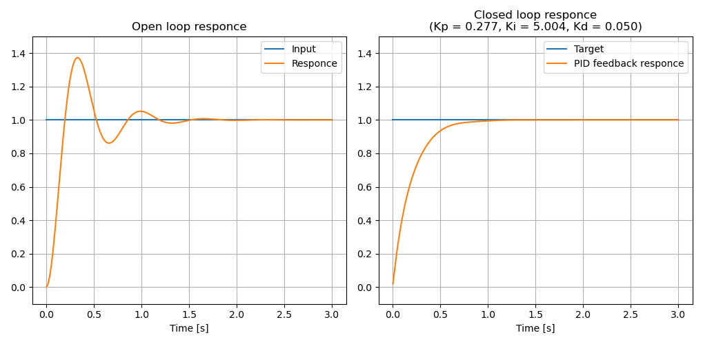
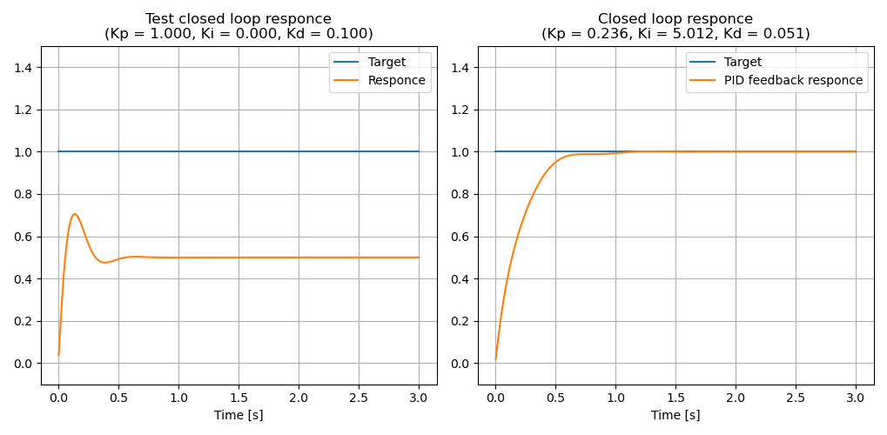

# VRFTによるPIDゲインの自動チューニング

!!! example "ソースコード"
    [example/controller/vrft_pid.cpp](https://github.com/Kotakku/cpp_robotics/blob/develop/example/controller/vrft_pid.cpp)

角周波数10[rad/s]、減衰係数0.3のシステムを例に考える

$$
G(s) = \frac{10^2}{s^2 + 2 \cdot 0.3 \cdot 10 s + 10^2}
$$

## 開ループでの実験結果からチューニング

左の図はゲイン1のステップ応答の測定結果で、この結果をもとにチューニングを行い、VRFTで求めたPIDパラメータを使ってステップ応答をシミュレーションした結果が右の図である

## 閉ループでの実験結果からチューニング

適当なPIDパラメータ(ここでは$Kp=1.0, Ki=0, Kd=0.1$)を用いてステップ応答を測定した結果を用いてチューニングを行い、VRFTで求めたPIDパラメータを使ってステップ応答をシミュレーションした結果が右の図である

