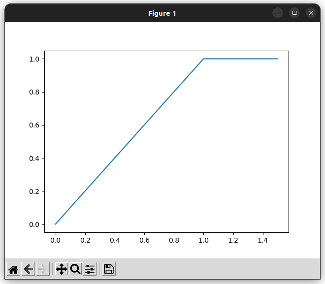
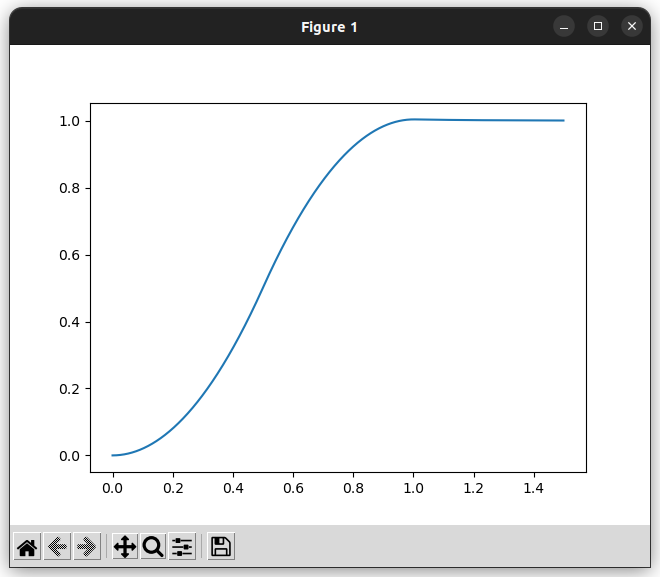

# VelocityLimitFilter & AccelerationLimitFilter

!!! example "ソースコード"
    [example/filter/vel_limit_filter.cpp](https://github.com/Kotakku/cpp_robotics/blob/develop/example/filter/vel_limit_filter.cpp)

## 速度制限フィルタ(VelocityLimitFilter)
入力の1回微分を制限します

## 加速度制限フィルタ(AccelerationLimitFilter)
入力の2回微分を制限します

