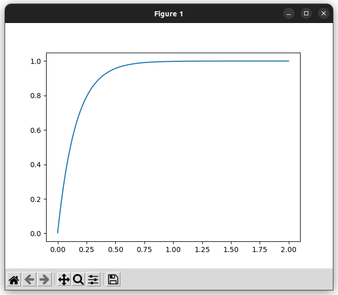
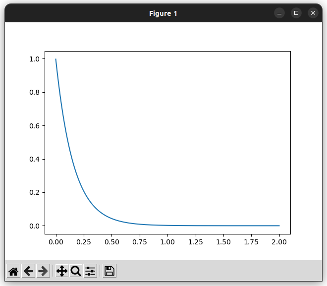

# LPF, HPF

!!! example "ソースコード"
    [example/filter/lpf_step.cpp](https://github.com/Kotakku/cpp_robotics/blob/develop/example/filter/lpf_step.cpp)  
    [example/filter/hpf_step.cpp](https://github.com/Kotakku/cpp_robotics/blob/develop/example/filter/hpf_step.cpp)

LPFとHPFのステップ応答を調べます

## LPFのステップ応答

## HPFのステップ応答
