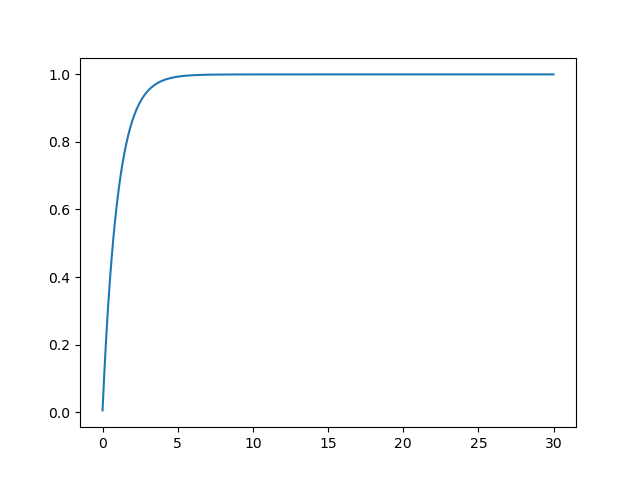
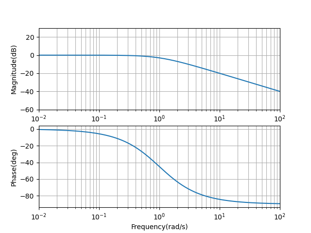
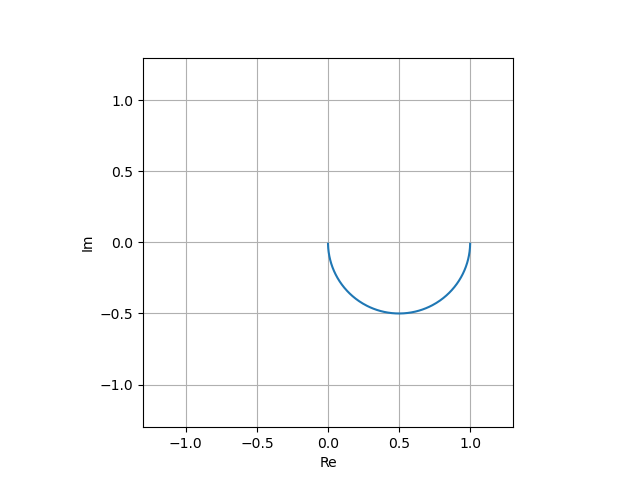

# Hello World

!!! example "ソースコード"
    [example/hello_world.cpp](https://github.com/Kotakku/cpp_robotics/blob/develop/example/hello_world.cpp)

cpp_roboticsの機能の一例として以下の機能を使っています  

- Vector : EigenのVector2d, Vector3d etcと違ってconstexprにでき、数学関数もいくつかメンバ関数として実装しています
- LQR : 状態方程式からLQRでフィードバックゲインを求めます
- Polynomal : 多項式の評価や合成を行います
- TransferFunction : 伝達関数の合成やシミュレーションを行います
- bode/nyquist : ボード線図やナイキスト線図を表示します

出力

```text
constexpr 2D vector: (3,4), norm = 5

LQR feedback vector
10  8

polynomial
( 1x^2 + 3 )
(x-2)*(x+2) = ( 1x^2 - 4 )

G(s) = 
  1
-----
1s +1

C(s) = 
 1s +1
--------
0.01s +1

C(s)*G(s) = 
      1s +1
-----------------
0.01s^2 +1.01s +1

transfer function step responce
transfer function bode fig plot
transfer function nyquist fig plot
```


ステップ応答



ボード線図



ナイキスト線図

