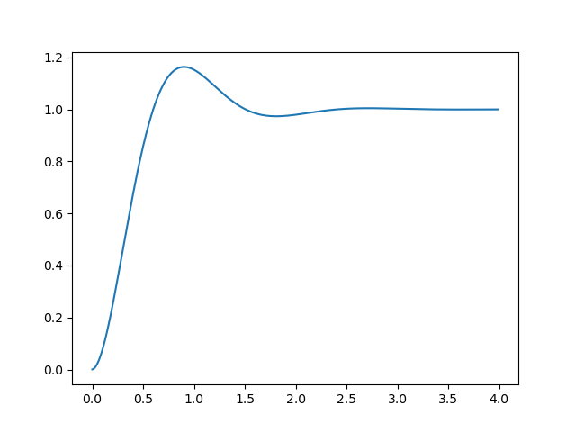

# 伝達関数のステップ応答

!!! example "ソースコード"
    [example/system/step_responce.cpp](https://github.com/Kotakku/cpp_robotics/blob/develop/example/system/step_responce.cpp)

$$
G(s) = \frac{4^2}{s^2 + 2 \cdot 0.5 \cdot 4 \cdot s + 4^2}
$$

