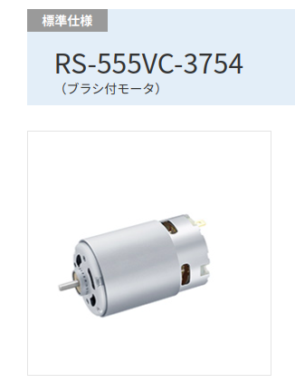
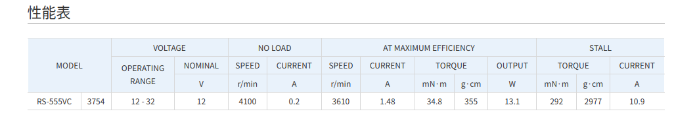

# マブチモータのスペック読み取り

マブチの製品ページにはこのように性能表が載っているがここの情報から計算をして静特性を解析する

## 静特性
静特性は公開してある性能表から計算が出来る。個体値もあるので参考程度
### 公称電圧[V]
VOLTAGE - NOMINAL
### 無負荷時回転数[rpm]
NO LOAD - SPEED
### 無負荷時電流[A]
NO LOAD - CURRENT
### ストール電流[A]
STALL - CURRENT
### ストールトルク
STALL - TORQUE
### 電機子抵抗[ohm]
公称電圧 / ストール電流
### トルク定数[Nm/A]
ストールトルク / (ストール電流 - 無負荷電流)
### 逆気電力定数[V/(rad/s)]
(公称電圧 - 電機子抵抗×無負荷電流)/無負荷回転数[rad/s]
### トルク損失[Nm]
無負荷時電流×トルク定数
### 粘性係数[Nms]
トルク損失/無負荷回転数[rad/s]

## 動特性
動特性は性能表からはわからないので計測する
### 電機子インダクタンス[H]
### 電気的時定数[s]
電機子インダクタンス/電機子抵抗
### ロータ慣性モーメント[kgm^2]
動特性は性能表からはわからないので計測する

## 参考文献
- [RS-555VC-3754](https://product.mabuchi-motor.co.jp/detail.html?id=119)